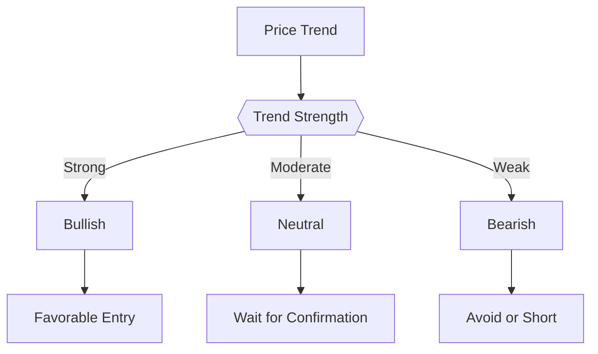

# Stock Research Report: {symbol} - {company_name}

**Analysis Date**: {analysis_date}  
**Period Analyzed**: {period}  
**Analyst**: Proteus Stock Research Skill  
**Report ID**: {report_id}

---

## 📋 Executive Summary

### Key Findings
- **Current Price**: ${current_price} ({price_change_pct}% from analysis start)
- **Recommendation**: **{recommendation}** ({conviction} conviction)
- **Overall Score**: {total_score}/100
- **Price Target**: ${price_target} ({target_return_pct}% potential return)
- **Stop Loss**: ${stop_loss}

### Investment Thesis
{investment_thesis}

---

## 1. Company Overview

### Basic Information
| Metric | Value |
|--------|-------|
| **Company Name** | {company_name} |
| **Symbol** | {symbol} |
| **Sector** | {sector} |
| **Industry** | {industry} |
| **Market Cap** | ${market_cap_formatted} |
| **Country** | {country} |
| **52-Week Range** | ${fifty_two_week_low} - ${fifty_two_week_high} |

### Business Description
{business_description}

---

## 2. Technical Analysis

### Current Technical Indicators
| Indicator | Value | Signal |
|-----------|-------|--------|
| **Current Price** | ${current_price} | - |
| **20-Day MA** | ${ma_20} | {ma_20_signal} |
| **50-Day MA** | ${ma_50} | {ma_50_signal} |
| **200-Day MA** | ${ma_200} | {ma_200_signal} |
| **RSI (14)** | {rsi} | {rsi_signal} |
| **Bollinger Position** | - | {bb_position} |

### Trend Analysis

### Key Technical Levels
- **Support**: ${support_levels}
- **Resistance**: ${resistance_levels}
- **Breakout Level**: ${breakout_level}

---

## 3. Fundamental Analysis

### Valuation Metrics
| Metric | Value | Industry Avg | Assessment |
|--------|-------|--------------|------------|
| **P/E Ratio** | {pe_ratio} | {industry_pe} | {pe_assessment} |
| **P/B Ratio** | {pb_ratio} | {industry_pb} | {pb_assessment} |
| **P/S Ratio** | {ps_ratio} | {industry_ps} | {ps_assessment} |
| **Dividend Yield** | {dividend_yield}% | {industry_dy}% | {dy_assessment} |

### Financial Health
| Metric | Value | Assessment |
|--------|-------|------------|
| **Profit Margin** | {profit_margin}% | {profit_margin_assessment} |
| **ROE** | {roe}% | {roe_assessment} |
| **Debt/Equity** | {debt_equity} | {debt_assessment} |
| **Current Ratio** | {current_ratio} | {liquidity_assessment} |

### Growth Metrics
- **Revenue Growth (YoY)**: {revenue_growth}%
- **Earnings Growth (YoY)**: {earnings_growth}%
- **Projected Growth (Next Year)**: {projected_growth}%

---

## 4. Risk Assessment

### Quantitative Risk Metrics
| Risk Metric | Value | Assessment |
|-------------|-------|------------|
| **Annual Volatility** | {annual_volatility}% | {volatility_assessment} |
| **Maximum Drawdown** | {max_drawdown}% | {drawdown_assessment} |
| **Sharpe Ratio** | {sharpe_ratio} | {sharpe_assessment} |
| **Beta** | {beta} | {beta_assessment} |

### Risk Factors
#### Market Risks
{market_risks}

#### Company-Specific Risks
{company_risks}

#### Sector Risks
{sector_risks}

---

## 5. Trading Recommendation

### Recommendation Summary
| Component | Score | Assessment |
|-----------|-------|------------|
| **Technical Analysis** | {technical_score}/50 | {technical_assessment} |
| **Fundamental Analysis** | {fundamental_score}/50 | {fundamental_assessment} |
| **Risk Assessment** | {risk_score}/50 | {risk_assessment} |
| **Total Score** | **{total_score}/100** | **{overall_assessment}** |

### Specific Recommendations
**Action**: {recommendation} ({conviction})

**Entry Strategy**:
{entry_strategy}

**Exit Strategy**:
- **Profit Target**: ${price_target} ({target_return_pct}% return)
- **Stop Loss**: ${stop_loss} ({stop_loss_pct}% risk)
- **Time Horizon**: {time_horizon}

**Position Sizing**: {position_sizing}

### Risk Management Guidelines
{risk_management_guidelines}

---

## 6. Monitoring & Follow-up

### Key Metrics to Watch
{key_metrics_to_watch}

### Catalyst Calendar
{upcoming_catalysts}

### Review Schedule
{review_schedule}

---

## 📊 Appendix: Data & Charts

### Historical Performance Chart

### Technical Indicators Chart

### Peer Comparison
{peer_comparison_table}

---

## ⚠️ Important Disclosures

### Limitations
{limitations}

### Disclaimer
{disclaimer}

---

**Report Generated by Proteus Stock Research Skill**  
*This report is for informational purposes only and does not constitute financial advice.  
Past performance is not indicative of future results. Always conduct your own research and consult with a qualified financial advisor before making investment decisions.*
