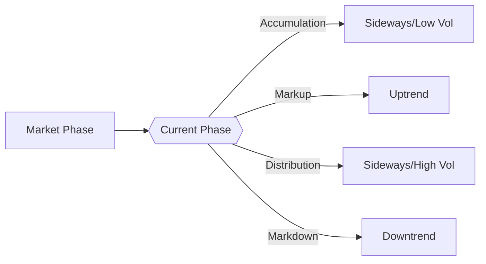

# Technical Analysis Template

## Stock: {symbol}
## Analysis Date: {date}
## Timeframe: {timeframe}

---

## 1. Price Action Analysis

### Current Price Levels
- **Current Price**: ${current_price}
- **Opening Price**: ${open_price}
- **Daily High**: ${high_price}
- **Daily Low**: ${low_price}
- **Previous Close**: ${prev_close}

### Support & Resistance Levels
| Level | Price | Strength | Notes |
|-------|-------|----------|-------|
| **Resistance 1** | ${resistance_1} | {strength_1} | {notes_1} |
| **Resistance 2** | ${resistance_2} | {strength_2} | {notes_2} |
| **Current Price** | ${current_price} | - | - |
| **Support 1** | ${support_1} | {strength_3} | {notes_3} |
| **Support 2** | ${support_2} | {strength_4} | {notes_4} |

---

## 2. Trend Analysis

### Trend Identification
- **Primary Trend**: {primary_trend} ({primary_trend_strength})
- **Secondary Trend**: {secondary_trend} ({secondary_trend_strength})
- **Short-term Trend**: {short_term_trend} ({short_term_strength})

### Moving Averages Analysis
| Moving Average | Value | Price vs MA | Signal |
|----------------|-------|-------------|--------|
| **5-Day MA** | ${ma_5} | {price_vs_ma_5} | {signal_ma_5} |
| **20-Day MA** | ${ma_20} | {price_vs_ma_20} | {signal_ma_20} |
| **50-Day MA** | ${ma_50} | {price_vs_ma_50} | {signal_ma_50} |
| **200-Day MA** | ${ma_200} | {price_vs_ma_200} | {signal_ma_200} |

### Trend Strength Indicators
- **ADX (14)**: {adx} ({adx_strength})
- **+DI**: {plus_di}
- **-DI**: {minus_di}

---

## 3. Momentum Indicators

### Oscillators
| Indicator | Value | Signal | Overbought/Oversold |
|-----------|-------|--------|---------------------|
| **RSI (14)** | {rsi} | {rsi_signal} | {rsi_level} |
| **Stochastic %K** | {stoch_k} | {stoch_signal} | {stoch_level} |
| **Stochastic %D** | {stoch_d} | - | - |
| **MACD** | {macd} | {macd_signal} | - |
| **MACD Signal** | {macd_signal_line} | - | - |
| **MACD Histogram** | {macd_histogram} | {macd_hist_signal} | - |

### Volume Analysis
- **Current Volume**: {current_volume}
- **Volume vs Avg**: {volume_vs_avg}%
- **Volume Trend**: {volume_trend}
- **On-Balance Volume (OBV)**: {obv_trend}

---

## 4. Volatility Analysis

### Volatility Indicators
| Indicator | Value | Interpretation |
|-----------|-------|---------------|
| **ATR (14)** | ${atr} | {atr_interpretation} |
| **Bollinger Band Width** | {bb_width}% | {bb_width_interpretation} |
| **Historical Volatility** | {hist_vol}% | {hist_vol_interpretation} |
| **Implied Volatility** | {implied_vol}% | {implied_vol_interpretation} |

### Bollinger Bands Analysis
- **Upper Band**: ${bb_upper}
- **Middle Band**: ${bb_middle}
- **Lower Band**: ${bb_lower}
- **Current Position**: {bb_position}
- **Band Squeeze**: {bb_squeeze}

---

## 5. Chart Patterns

### Identified Patterns
{chart_patterns}

### Pattern Confirmation
- **Pattern Reliability**: {pattern_reliability}/10
- **Price Target from Pattern**: ${pattern_target}
- **Pattern Completion**: {pattern_completion}%

---

## 6. Market Structure

### Market Phase Identification

### Key Market Levels
{key_market_levels}

---

## 7. Technical Summary & Signals

### Signal Summary Table
| Timeframe | Trend | Momentum | Volatility | Overall Signal |
|-----------|-------|----------|------------|----------------|
| **Short-term** | {short_term_trend} | {short_term_momentum} | {short_term_vol} | {short_term_signal} |
| **Medium-term** | {medium_term_trend} | {medium_term_momentum} | {medium_term_vol} | {medium_term_signal} |
| **Long-term** | {long_term_trend} | {long_term_momentum} | {long_term_vol} | {long_term_signal} |

### Key Technical Signals
1. **Primary Signal**: {primary_signal}
2. **Secondary Signal**: {secondary_signal}
3. **Confirmation Signal**: {confirmation_signal}

### Risk Levels
- **Technical Risk**: {technical_risk}/10
- **Stop Loss Level**: ${stop_loss_technical}
- **Risk/Reward Ratio**: {risk_reward_ratio}

---

## 8. Trading Implications

### Entry Points
{entry_points}

### Exit Strategies
{exit_strategies}

### Position Sizing Recommendations
{position_sizing}

### Trade Management
{trade_management}

---

## 9. Monitoring Plan

### Key Levels to Watch
{key_levels_to_watch}

### Signal Triggers
{signal_triggers}

### Review Timeline
{review_timeline}

---

**Technical Analysis Generated by Proteus Stock Research Skill**  
*Technical analysis is based on historical price patterns and indicators. Past performance is not indicative of future results.*
